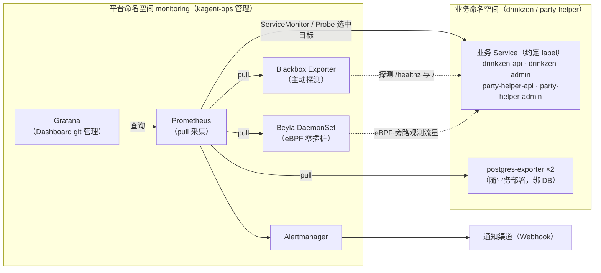

# 业务服务可观测性总体设计

> 适用对象：`drinkzen`、`party-helper` 两个业务命名空间
> 平台仓库：`kagent-ops`（观测平台侧，即本文档所在仓库）
> 设计原则：**标准 Kubernetes + Helm**，不与任何发行版（k3s/kind/docker-desktop 等）耦合；发行版差异统一放「环境注意事项」附录。
> 状态：Phase 1（指标）设计定稿，待实施。

---

## 1. 背景与现状

| 现状 | 说明 |
| --- | --- |
| L0 可用性探测已就绪 | Blackbox Probe + 告警规则已在仓库（见 `RUNBOOK.md`），探测 4 个服务入口 |
| 业务应用无 `/metrics` | 两个 API（均为 FastAPI / uvicorn）仅有 `/healthz`；两个 admin 为纯前端 SPA，对其任意路径均返回 200 HTML |
| 集群内 PostgreSQL ×2 | 各业务命名空间一个 StatefulSet，可零代码接入 DB 指标 |
| 平台组件未部署 | 当前集群无 monitoring 相关组件，需按本方案部署 |
| 遗留问题 | admin 探测有效性不足、party-helper-api 端口命名不一致，详见下文「遗留问题详解」 |

### 1.1 遗留问题详解

#### 问题 A：admin 前端探测有效性不足

| 维度 | 说明 |
| --- | --- |
| 现象 | `http_2xx_root` 模块探测 admin 的 `/`，接受 200/301/302 等。admin 是 SPA，兜底路由对**任意路径**（包括 `/metrics`、不存在的资源）都返回 200 HTML——实测 `GET /metrics` 返回的是 HTML 页面而非指标 |
| 根因 | ① SPA 服务器 fallback：资源缺失、路由错误本应 404 的请求被兜底渲染成 200；② admin 没有真实健康端点（无 `/healthz`） |
| 影响 | 探测只能证明"HTTP 进程有响应"，**无法发现静态资源 404、页面损坏类故障**（漏报）；另外 `/metrics` 假 200 容易让人误以为已有指标端点 |
| 处理建议（三选一） | (a) 业务侧给 admin 增加 `/healthz`（最干净）；(b) 改为探测真实静态资源（如 HTML 引用的 `/brand/*.png`）并校验非空；(c) 接受现状，明确 probe 语义仅为"端口存活" |

#### 问题 B：party-helper-api 端口命名不一致

| 维度 | 说明 |
| --- | --- |
| 现象 | 容器监听 `8021`（uvicorn `--port 8021`），Service 对外却是 `port 8022 → targetPort 8021`（NodePort 32593），Blackbox Probe 直连 `8021` |
| 根因 | 部署时端口规划未对齐，靠 `targetPort` 映射掩盖 |
| 影响 | 流量本身是通的，但同一服务存在 8021/8022 两个数字：外部调用走 8022、Pod 内是 8021，文档与脚本易混淆；后续改动若只改其一（如 Probe 改指 Service 端口、或调 port 忘改 targetPort）会引入真实故障 |
| 处理建议 | 统一为 8021（Service `port 8022→8021`）；注意已有 `LoadBalancer:8022` 与 `NodePort 32593` 在用，改动需同步所有调用方。最低成本方案：给 Service 端口命名（`name: http`）并在文档标注映射关系 |

> RUNBOOK 另记录两条环境类已知限制（drinkzen-api 容器内 wget/curl 异常、本地单节点自签证书禁抓 apiserver），属环境现象而非设计问题，见 `RUNBOOK.md`。

## 2. 预期效果

### 2.1 能回答的问题（按成本递进）

1. **服务活着吗** — 外部探测可用性、TLS 有效期（已有）
2. **活着但表现如何** — HTTP RED：QPS、P95/P99 延迟、错误率（零插桩获取）
3. **数据库健康吗** — 连接数、事务速率、慢查询、缓存命中率（零插桩获取）
4. **Pod 层正常吗** — 重启次数、OOMKilled、CPU/内存用量与限流（平台自带）
5. **（后续）为什么慢** — 日志细节 → 跨服务链路定位（Phase 2/3）

### 2.2 交付物与验收标准

| 类别 | 交付物 | 验收标准 |
| --- | --- | --- |
| 指标采集 | Prometheus 抓取全部业务入口 | `up`、`probe_success`、RED 指标均有数据 |
| 告警 | Alertmanager 规则集 | 模拟故障（scale to 0）2 分钟内触发告警并可送达通知渠道 |
| 可视化 | Grafana Dashboard（git 管理） | 可用率 / RED / 资源 / PostgreSQL 四类面板开箱可用 |
| 文档 | RUNBOOK 更新 | 新人按 RUNBOOK 30 分钟内完成平台部署 |

### 2.3 告警覆盖（Phase 1 目标）

| 告警 | 条件 | 持续 | 级别 |
| --- | --- | --- | --- |
| HttpProbeFailed | `probe_success == 0` | 2m | warning |
| HttpProbeSlow | P95 探测延迟 > 1s | 5m | warning |
| PodRestartBurst | 容器重启次数 30m 内 > 3 | 5m | warning |
| PodOOMKilled | 上次终止原因为 OOMKilled | 即时 | warning |
| PgExporterDown | `up{job=~".*postgres.*"} == 0` | 5m | warning |
| PgTooManyConnections | 连接数 > max*0.85 | 10m | warning |

## 3. 总体架构（pull / client-server 模型）

### 3.1 职责边界

| 归属 | 内容 |
| --- | --- |
| **业务项目**（drinkzen / party-helper 仓库） | SDK 埋点代码（L3，可选）；exporter 部署与只读监控账号（绑数据库生命周期）；暴露 metrics 端口；保持规范 label；修复自身端口不一致 |
| **kagent-ops（本项目）** | 平台组件（Prometheus / Grafana / Alertmanager / Blackbox / Beyla）；采集声明（ServiceMonitor / PodMonitor / Probe）；告警规则；Dashboard；本设计文档与 RUNBOOK |

### 3.2 两边解耦的契约（唯一接口）

业务项目不需要知道平台的存在，只需遵守两条约定：

1. **Label 约定**：Service 使用 Kubernetes 推荐 label（`app.kubernetes.io/name`、`app.kubernetes.io/component`），平台 selector 依据它发现目标。
2. **端口约定（Phase 2 起）**：metrics 端口命名为 `metrics`（端口 9090/自定义均可），Prometheus 通过端口名识别。

> 当前 kube-prometheus-stack values 已设 `*SelectorNilUsesHelmValues: false`，即 Prometheus 接受集群内全部 ServiceMonitor/PodMonitor/Rule，业务侧无需额外注册。

## 4. 技术选型

| 需求 | 选型 | 备选 | 理由 |
| --- | --- | --- | --- |
| 指标存储与查询 | **Prometheus**（kube-prometheus-stack） | VictoriaMetrics、Thanos | K8s 可观测事实标准；告警生态（PromQL/Alertmanager）最成熟；单集群规模下成本最低；业务项目大多默认兼容 |
| 平台部署形态 | **kube-prometheus-stack**（Helm） | 手工组装 Prometheus Operator | 一键含 Prometheus/Grafana/Alertmanager/blackbox/kube-state-metrics；配置即代码（values.yaml 进 git） |
| HTTP RED 指标（零插桩） | **Grafana Beyla**（eBPF DaemonSet） | OTel Operator 自动注入；业务埋点 | **Phase 1 核心选择**：不改业务一行代码即可获得 RED；局限：无业务语义（版本号/租户等），路由聚合较粗 → 需要 finer 粒度时进 L3 |
| 链路追踪（Phase 3） | OTel Operator + Tempo | Jaeger | OTel 已是 CNCF 标准，自动注入对 FastAPI 成熟；Tempo 与 Grafana 生态契合、对象存储成本低 |
| 日志（Phase 2） | Loki + Alloy | ELK/EFK | 存储成本低一个量级（只索引 label）；Alloy 为 Promtail 后继 |
| PostgreSQL 指标 | **prometheus-postgres-exporter** | pgwatch、内置 pg_stat 查询 | 社区标准 exporter；与 pull 模型契合；随业务部署 |
| 主动探测 | Blackbox Exporter（已就绪） | 云拨测 | 已有 Probe CRD + 规则，继续沿用 |
| 告警通知 | Alertmanager + Webhook | 邮件、Slack | Webhook 可对接任意内部渠道（飞书机器人等），本地环境实现解耦 |
| Dashboard 管理 | Grafana sidecar + ConfigMap | 手工导入 | Dashboard JSON 进 git，可 review、可回滚（values 已启用 `grafana_dashboard` label） |

**明确的非选型**：商用 APM（Datadog 等）——本地自建环境成本不匹配；InfluxDB/OpenTelemetry Collector 自建指标栈——无存量负担时没必要偏离事实标准。

## 5. 实施清单（Phase 1，全部零业务代码改动）

### 5.1 kagent-ops 仓库内新增/修改

| 文件 | 动作 |
| --- | --- |
| `kagent-config/monitoring/values.yaml` | 更新：启用 Alertmanager；blackbox 修正 admin 探测（收紧 accept 状态码） |
| `kagent-config/monitoring/beyla/values.yaml` | 新增：Beyla DaemonSet，暴露 Prometheus 指标 + ServiceMonitor |
| `kagent-config/monitoring/prometheus-rules/pod-health.yaml` | 新增：Pod 重启/OOM 告警 |
| `kagent-config/monitoring/prometheus-rules/postgres.yaml` | 新增：PG 告警 |
| `kagent-config/monitoring/service-monitors/` | 新增：Beyla / postgres-exporter 的 ServiceMonitor 模板 |
| `kagent-config/monitoring/dashboards/` | 新增：Dashboard JSON（ConfigMap 化） |
| `kagent-config/monitoring/RUNBOOK.md` | 更新：部署步骤、去发行版化、验证清单 |

### 5.2 业务项目配合项

#### Phase 1：业务仓库零改动（仅确认两件事）

| # | 配合项 | 责任方 | 说明 |
| --- | --- | --- | --- |
| 1 | Service label 符合推荐规范 | drinkzen / party-helper | 已符合（实测确认），保持即可 |
| 2 | party-helper-api Service 端口 8022→8021 修正 | party-helper | 已知限制 #1，建议顺手修复 |

#### Phase 2（exporter，需要业务提供凭据）

| # | 配合项 | 责任方 | 说明 |
| --- | --- | --- | --- |
| 3 | 每个业务库创建只读监控账号（`pg_monitor` 角色） | drinkzen / party-helper | 业务 repo 持有 DSN，本项目提供 Secret 模板 |
| 4 | 部署 prometheus-postgres-exporter 至业务命名空间 | 业务 repo（本项目出模板） | exporter 生命周期与数据库绑定，故归业务 |

#### Phase 3（埋点，可选，业务代码改动）

| # | 配合项 | 责任方 |
| --- | --- | --- |
| 5 | drinkzen-api 引入 `prometheus-fastapi-instrumentator` | drinkzen |
| 6 | party-helper-api 引入框架 metrics 中间件 | party-helper |
| 7 | （可选）OTel SDK 自动注入验证 | 双方 |

### 5.3 环境注意事项（发行版差异收口）

- StorageClass：values 中 `storageClassName` 留空，使用集群默认；发行版差异不进方案正文
- 访问方式：统一 `kubectl port-forward`；NodePort/LoadBalancer 仅作本地便捷选项
- 自签证书抓取失败（本地单节点常见）：维持 kubeAPIServer 抓取关闭的说明放 RUNBOOK 附录

## 6. 路线图

| 阶段 | 内容 | 前置 |
| --- | --- | --- |
| **Phase 1（本次）** | 指标：平台部署 + Beyla RED + PG exporter + 告警 + Dashboard | 无（业务零改动） |
| Phase 2 | 日志：Loki + Alloy，stdout 采集 | Phase 1 |
| Phase 3 | 链路：OTel Operator + Tempo，注解注入 | Phase 1 |
| L3 业务埋点 | 按路由 RED、业务语义指标、手动 Span | 按需，随业务迭代 |

排序依据：**指标发现问题 → 日志看细节 → 链路定位根因**，成本递增、收益递进，每阶段独立可用。

## 7. 风险与限制

| 风险 | 影响 | 缓解 |
| --- | --- | --- |
| Beyla 依赖 eBPF（内核 ≥ 5.8、需特权） | 个别环境不可用 | 回退方案：业务侧 ServiceMonitor + 最小埋点（L3 提前） |
| Beyla 指标无业务语义、路由聚合较粗 | 无法按业务维度下钻 | 记录在选型局限，触发条件出现时进 L3 |
| admin 为 SPA，无应用层指标 | 前端体验不可量化 | 保持黑盒探测定位；前端性能观测不纳入本方案 |
| 本地单节点存储有限 | Prometheus 数据保留受限 | 已设 15d/10Gi；生产环境调大并接对象存储 |
| 通知渠道未定 | 告警触达 | Alertmanager Webhook 先行，渠道配置参数化 |

## 8. 参考

- [kube-prometheus-stack](https://github.com/prometheus-community/helm-charts/tree/main/charts/kube-prometheus-stack)
- [Grafana Beyla](https://grafana.com/oss/beyla-ebpf/)
- [prometheus-postgres-exporter](https://github.com/prometheus-community/helm-charts/tree/main/charts/prometheus-postgres-exporter)
- [Prometheus Operator API（ServiceMonitor/Probe）](https://prometheus-operator.dev/docs/api-reference/api/)
- [OpenTelemetry 自动注入](https://opentelemetry.io/docs/kubernetes/operator/automatic-instrumentation/)
